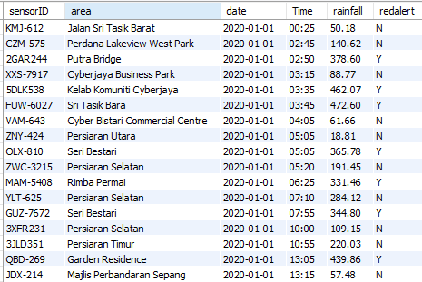
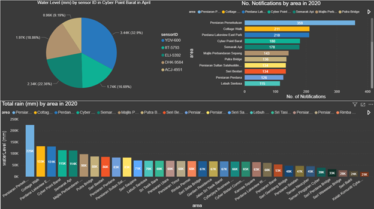
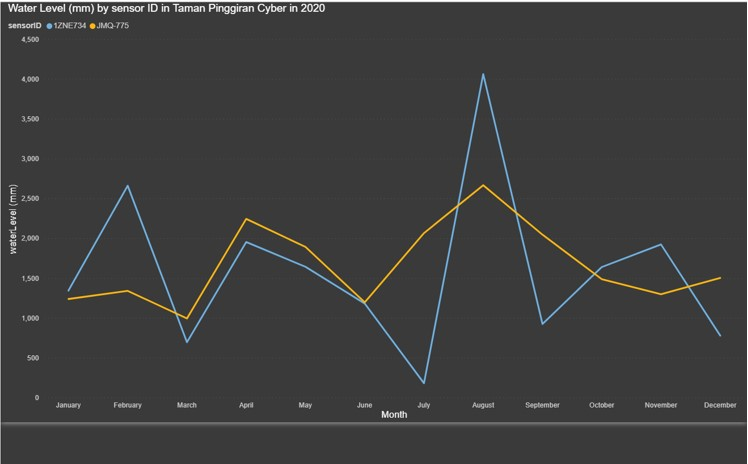

# Flood-control-BI-system

In this project, we have built a prototype of a small business intelligence system that gives insights for decision makers about the water level in multiple areas in Putrajaya and Cyberjaya. The system is based on a flood warning system that collects data from various sensors that are planted in specified areas each five minutes and store it in a database. In the database, each row shows the sensor ID, it is area, the date and time, water level in mm, and finally it shows an indicator that indicate if an alarm notification was given by that sensor at that time or not. The sensor gives a notification if the water level exceeded 300mm at that time.

  Since having access to the real sensors in that areas is not possible, we decided to create a dumb database and fill it with fake data to help us build the prototype. We used Python language and some of its libraries to build the database and store it in MySQL database. (You can refer to the code file to see how it works)
	The database will consist of three tables. The first table is the areas table and it will contain one column only which is the areas names. The second table is the sensors table. This table will consist of sensor ID column and the area column. The last table will consist of five column which are sensorID, date, time, rainfall (mm), and the flood alarm notification. 
  
  The structure of the dataset that will be exported to Power BI will be:

Then, by using Power BI from Microsoft, we managed to create a dashboard that shows multiple reports that can be beneficial for decision makers based on the data generated.

Below is a screehshot of the interactive dashboard that is divided into three sections. The upper left section shows the water level by each sensor in a specific region during a particular month. The user can easily switch between areas and months from a filter menu. The upper right section shows the numbers of notifications by each area in 2020. The lower section shows the total rain in the year 2020 by area:

Below is a screenshot of another interactive dashboard shows a linear graph of the water level in millimeter by sensor in a particular area throughout the year 2020:

